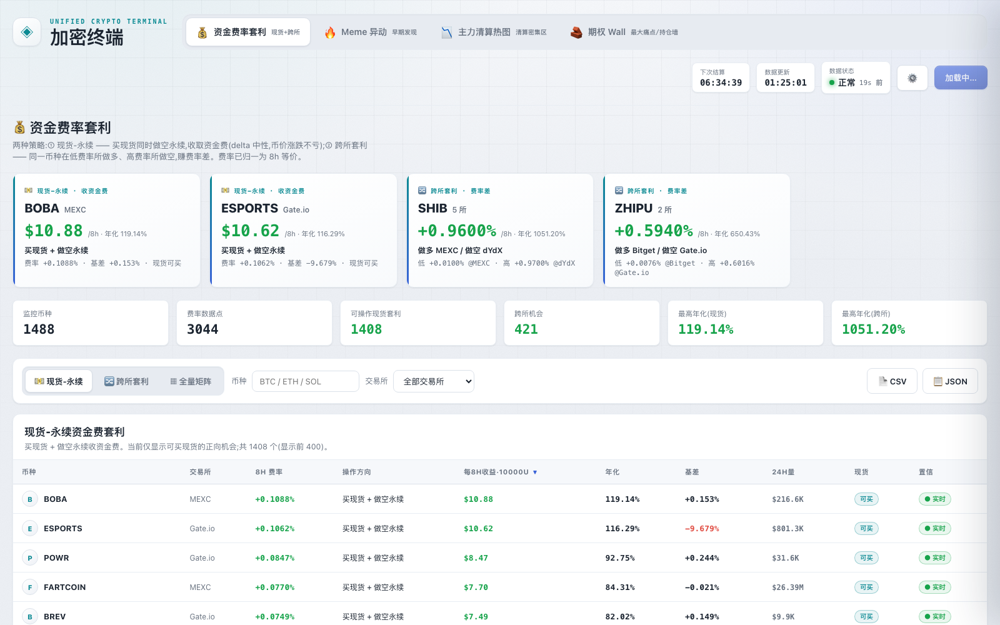
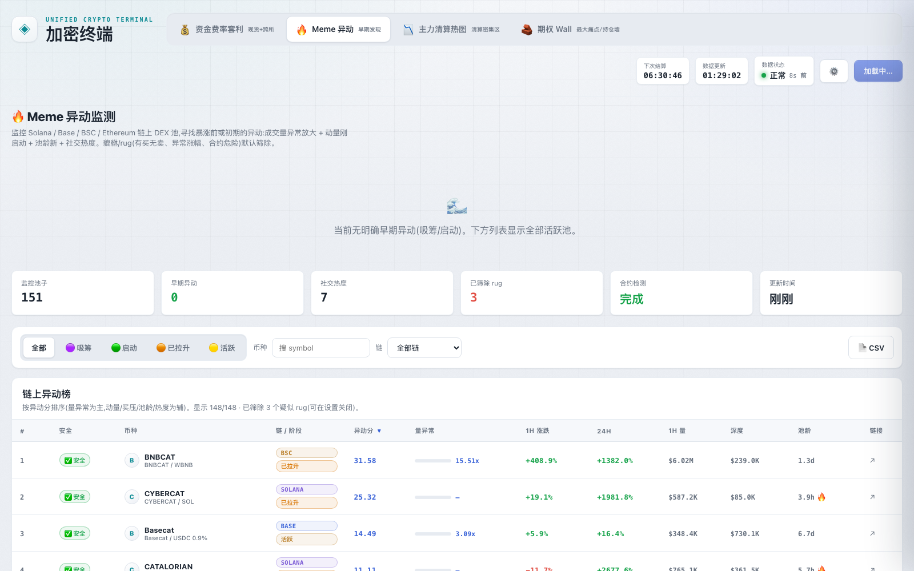
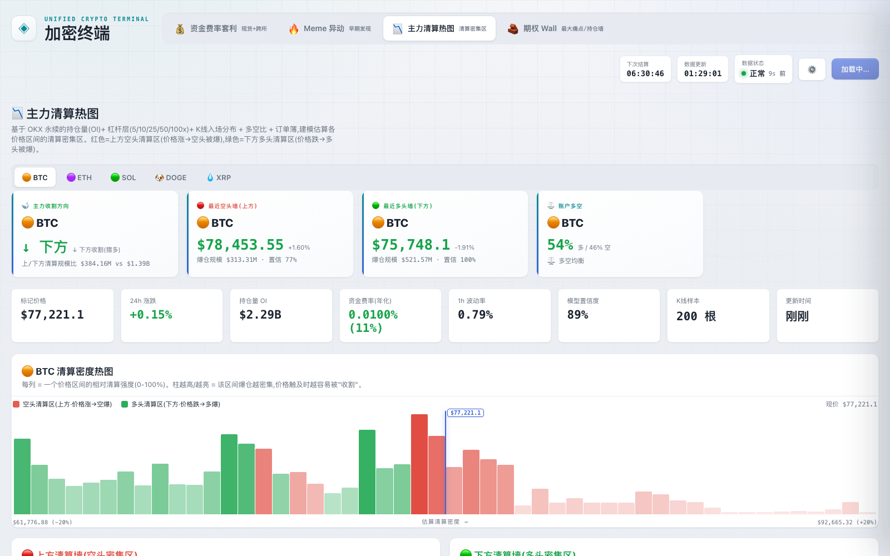
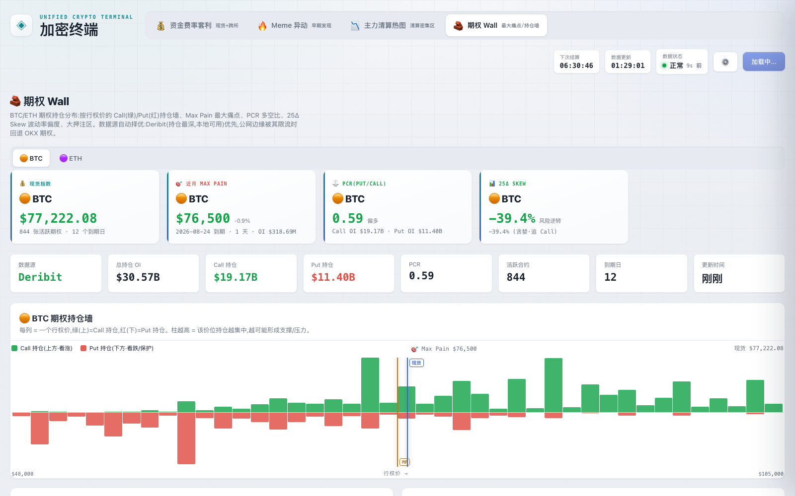

# 加密终端

我自己看盘用的一页。资金费率、链上 Meme、清算热图、期权墙，切来切去都在这儿，不用在五家交易所和一堆链上工具之间跳。

**现在开着：[crypto-funding-arbitrage.pages.dev](https://crypto-funding-arbitrage.pages.dev/)**

四个板块各自干一件事：

- **资金费率** — 找「现货能买、再空永续收资金费」的正向机会，或者同一币种的跨所费率差。Gate / MEXC / Bitget / OKX / Hyperliquid / dYdX 大概 3000 个永续，费率统一折成 8 小时再横着比。超过 15 分钟标陈旧。
- **Meme 异动** — Solana / Base / BSC / ETH 上量能刚起来、池子还新的标的。合约没检完只标「检测中」，有买无卖、明显 rug 的默认筛掉。
- **清算热图** — 用 OKX 持仓、杠杆分层和入场分布，估 BTC / ETH / SOL / DOGE / XRP 在哪些价位爆仓会堆在一起，红空绿多。
- **期权 Wall** — BTC / ETH 的 Call / Put 持仓墙、Max Pain、PCR、25Δ 偏度。Deribit 优先，被限流退 OKX。

没有框架，也没有打包，浏览器直连公开接口；国内走 Cloudflare 上的代理。本地兜底缓存会定期更新。下面截图可以点进去对应板块。

| 资金费率套利 | Meme 异动 |
|:---:|:---:|
| [](https://crypto-funding-arbitrage.pages.dev/#/funding) | [](https://crypto-funding-arbitrage.pages.dev/#/meme) |
| **主力清算热图** | **期权 Wall** |
| [](https://crypto-funding-arbitrage.pages.dev/#/liquidation) | [](https://crypto-funding-arbitrage.pages.dev/#/options) |

## 四大板块

### 💰 资金费率套利 `#/funding`

- **现货-永续套利**:买现货 + 做空永续,收资金费(delta 中性,币价涨跌不影响);自动筛出「现货可买」的正向机会
- **跨所套利**:同一币种在低费率所做多、高费率所做空,赚费率差
- 覆盖 Gate.io / MEXC / Bitget / OKX / Hyperliquid / dYdX **全量合约(约 3000 个)**;Binance / Bybit 因地区封锁(451/403)默认跳过
- 所有费率统一折算 **8h 等价**,可直接横向比较;每 8H 收益、年化、基差、24h 量一屏看清
- **时效诚实**:任何数据超过 15 分钟即标「陈旧」,置信分级(实时/低置信/陈旧),绝不用模拟数据补位
- 双击任意行看 **24h 费率历史走势**(IndexedDB 本地累积);内置**盈亏模拟器**(自定义本金/持仓时长)

### 🔥 Meme 异动 `#/meme`

- 监控 Solana / Base / BSC / Ethereum 链上 DEX 池,寻找暴涨前/初期的异动:成交量异常放大 + 动量刚启动 + 池龄新 + 社交热度
- 数据源:GeckoTerminal + DexScreener;合约安全检测:GoPlus
- **貔貅/rug 防线**:有买无卖、异常涨幅、合约危险默认筛除;**未完成检测的 token 绝不标「安全」**(只标「检测中」)

### 📉 主力清算热图 `#/liquidation`

- 基于 OKX 永续的持仓量(OI)+ 杠杆层(5/10/25/50/100x)分布 + K 线入场分布 + 多空比,建模估算各价格区间的**清算密集区**
- BTC / ETH / SOL / DOGE / XRP 五个币种;红 = 上方空头清算区(价格涨 → 空头被爆),绿 = 下方多头清算区(价格跌 → 多头被爆)
- 给出主力收割方向、最近空/多头墙、账户多空比、模型置信度

### 🧱 期权 Wall `#/options`

- BTC / ETH 期权持仓分布:按行权价的 Call/Put 持仓墙、**Max Pain 最大痛点**、PCR 多空比、**25Δ Skew** 波动率偏度、大押注区
- 数据源自动择优:Deribit(持仓最深)优先,边缘被限流时回退 OKX 期权

## 技术要点

- **零构建前端**:原生 ES Modules + hash 路由 + 即插即用板块(`js/boards/*.js` 注册一个工厂函数即接入);浅色「瓷感」主题,纯 CSS 令牌
- **三级数据韧性**:浏览器实时直连 → CORS 代理(线上为 Cloudflare Pages Function `functions/proxy.js`,边缘取数不被墙;白名单防开放代理)→ 本地兜底缓存 `data/rates.json`
- **数据保鲜**:本机 launchd 任务每 10 分钟全量抓数 → 更新兜底缓存 → wrangler 部署上线
- **测试**:无 runner,`scripts/` 下确定性单测(mock 浏览器全局跑真实模块)

## 本地运行

```bash
node server.js          # http://localhost:8765
```

## 部署

Cloudflare Pages **direct-upload**(未连接 Git 集成),`git push` 不会更新线上:

```bash
export CLOUDFLARE_API_TOKEN=... CLOUDFLARE_ACCOUNT_ID=...
sh scripts/deploy-cloudflare-pages.sh
```

## 数据源

公开 API,无需任何密钥:Gate.io · MEXC · Bitget · OKX · Hyperliquid · dYdX · DexScreener · GeckoTerminal · GoPlus · Deribit

## 免责声明

本项目仅供学习与研究,所有数据来自公开接口,不构成任何投资建议。加密资产波动巨大,请自行评估风险。

## License

[MIT](LICENSE) © 2026 shangchaovo
